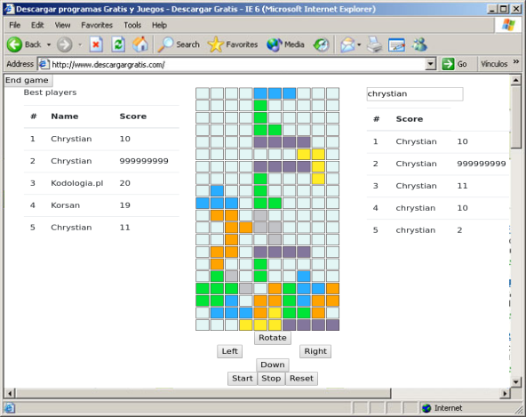

# FedTetris

[Angular](https://angular.io/) workshop repository with retro gaming theme that introduces basic angular concepts through building an interface for [ngx-tetris](https://www.npmjs.com/package/ngx-tetris) library.  

The goal of the workshop is to end up with a playable game like on the below image:  
 


## Running
```bash
npm install
```
then 
```bash 
ng serve
```
Navigate to `http://localhost:4200/`

## Workshop steps

You can pick up at any step of the course by selecting desired branch.
**IMPORTANT**: Task branches are for you to complete so try not to check them too quickly :) 

Branch name | Description
--- | ---
**master** | Fresh angular project generated with *ng new <project-name>*
**1.intro-form** | Creating intro module with dummy player form component
**2.TASK-main-game** | **Task branch**<br/> Creating main module and dummy game component
**3.game-start-btn** | Reacting to click even on button to hide player form component (start game)
**4.TASK-game-end-btn** | **Task branch**<br/>Reacting to click even on button to hide game (end game)
**5.intro-form-input** | Moving app intro (welcome text and angular logo) to player form component of intro module, passing app title through component input
**6.TASK-game-input** | **Task branch**<br/> Passing player name to game component throught input and displaying personalized message: <br/>*<player-name> game works!* <br/>on the screen
**7.form-submitted-event** | Moving game start button to player form component, emitting *submitted* event through component output 
**8.TASK-game-ended-event** | **Task branch**<br/> Moving game end button to game component, emitting *ended* event throught component output
**9.name-input-element** | Moving game start button to player form component, emitting *submitted* event through component output 
**10.TASK-email-input-element** | **Task branch**<br/> Moving game end button to game component, emitting *ended* event throught component output
**11.form-element** | Wrapping inputs with form element, adding localStorage logic to remember 'app state' in order to make it easier to work in the next steps (live reloading)
**12.tetris-core** | Installing tetris game core library, adding bootstrap and game template
**13.controller** | Creating controller component, moving game controls (buttons) to controller
**14.hotkeys** | Installing hotkeys library and adding keyboard controller support
**15.hiscore** | Creating hiscore component, fetching scores from server and displaying them, sorting and slicing with pipe 
**16.TASK-my-score** | **Task branch**<br/>Creating my score component that displays list of scores with desired string (player name preferably) 
**17.score-service** | Creating score service (sharing data between hiscore and myScore components) 
**18.score-submit** | Submitting score to the server 

## Authors

[Chrystian Ruminowicz](http://chrum.it)

#### Version
This project was generated with [Angular CLI](https://github.com/angular/angular-cli) version 7.0.6.
 


